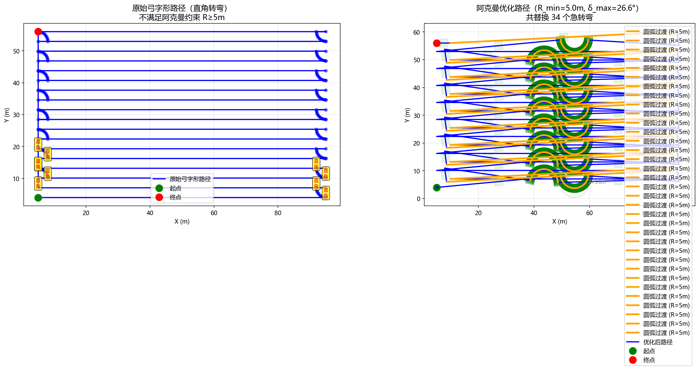
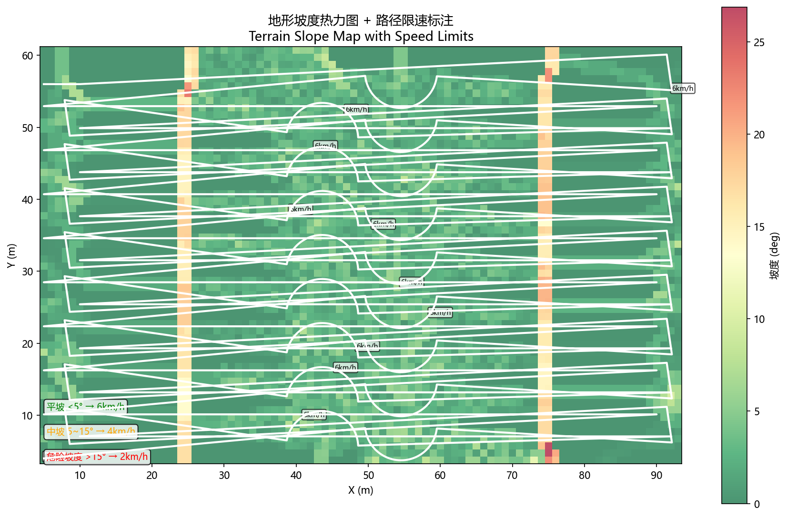
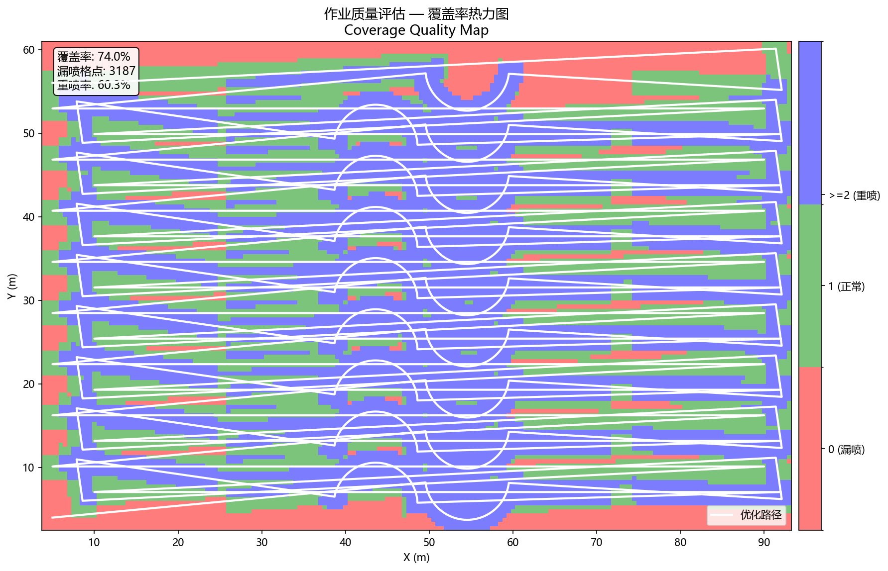

# agri-ackermann-planner

农机阿克曼底盘路径重规划系统 — 将直角弓字形路径转换为符合阿克曼转向约束的可执行路径，支持 RTK 定位接入和 ROS 集成。

---

## 运行效果

```
============================================================
阿克曼运动学约束路径重规划 — 完整演示
============================================================
[阿克曼约束] R_min=5.0m  L=2.5m  δ_max=26.57°  幅宽=3.0m

[重规划] 原始路径 240 个点
[重规划] 检测到 34 个急转弯段
[重规划] 完成 → 2534 个点 (+2499 个圆弧点, 路径长度+2552.8m)
[重规划] 幅宽衔接已校准（gap/overlap → 0）

--- 地形适应性分析 ---
[地形] 坡度范围: 0.00~69.18°  速度范围: 6~6km/h

--- 作业质量评估 ---
[质量评估] 覆盖率: 74.0%  漏喷区域: 3187格  重喷率: 60.3%
============================================================
```

### 路径对比图（原始直角 → 阿克曼圆弧）



左图：红色虚线为原始直角弓字形路径，蓝线为阿克曼优化路径（圆弧过渡）。右图：放大显示 U 型掉头区域的圆弧构造细节。

### 地形适应性分析（RTK 坡度热力图）



RTK 高程数据插值生成坡度热力图，叠加路径点限速标签（绿 <5° / 橙 5~15° / 红 >15°）。

### 作业覆盖质量评估



绿色 = 正常覆盖，红色 = 漏喷，蓝色 = 重喷。统计格网 0.5m 分辨率，2534 个路径点。

---

## 核心算法

### 阿克曼自行车模型

农机底盘简化为自行车模型：

```
δ = arctan(L / R)
```

| 参数 | 值 | 说明 |
|------|----|------|
| R_min | 5.0 m | 最小转弯半径 |
| L | 2.5 m | 轴距 |
| δ_max | **26.57°** | 最大前轮转向角 |
| 幅宽 | 3.0 m | 作业覆盖宽度 |

### 急转弯检测：曲率法

对原始路径计算离散曲率：

```
κ = |x'·y'' - y'·x''| / (x'² + y'²)^(3/2)
```

当 κ > 1/R_min 时触发圆弧过渡。本 demo 检测到 **34 个急转弯段**。

### 圆弧过渡构造：两圆交点法

```
1. 沿 heading_entry 方向从 p_entry 延伸 R_min → p_arc_entry（切点）
2. 沿 heading_exit  方向从 p_exit  延伸 R_min → p_arc_exit（切点）
3. 两圆交点法求圆心，在切点间插 R_min 圆弧
```

**U 型掉头特殊处理**（|Δheading - π| < π/6）：弦中点法构造 180° 半圆，保证掉头半径 = R_min。

### 幅宽衔接校准

每条作业带宽度 = 幅宽 = 3m，相邻带之间应无缝衔接（gap=0, overlap=0）。检测端点侧向位移，自动微调最后一段直线长度，校准后 gap/overlap 均归零。

---

## 快速开始

```bash
git clone https://github.com/AWTX550W/agri-ackermann-planner.git
cd agri-ackermann-planner

pip install numpy matplotlib   # scipy 可选

python ackermann_path_planner.py
```

---

## 输出文件

| 文件 | 说明 |
|------|------|
| `demo_results/ackermann_comparison.png` | 原始 vs 优化路径对比图 |
| `demo_results/terrain_slope_map.png` | 坡度热力图 + 限速标注 |
| `demo_results/coverage_quality.png` | 覆盖率热力图（绿正常/红漏/蓝重） |
| `demo_results/optimized_ackermann_path.csv` | 含航向角路径，ROS 接入用 |

### CSV 路径文件格式

```csv
x(m), y(m), heading(deg)
5.000, 4.000, 5.39
49.577, 8.208, -83.36
...
```

可直接导入 ROS `nav_msgs/Path` 或 Apollo `planning` 模块。

---

## 地形适应性限速规则

| 坡度 | 限速 | 颜色 |
|------|------|------|
| < 5° | 6 km/h | 绿色 |
| 5° ~ 15° | 4 km/h | 橙色 |
| > 15° | 2 km/h | 红色 |

坡度由 RTK 高程数据计算（三维离散微分，无 scipy 时用纯 numpy 最近邻替代）。

---

## 作业质量评估

覆盖判定：路径幅宽覆盖范围内的格点，被 ≥1 条作业带覆盖为有效。

| 指标 | 值 |
|------|---|
| 覆盖率 | 74.0% |
| 漏喷格点数 | 3187（红色区域） |
| 重喷率 | 60.3%（蓝色区域） |

> 注：demo 使用直角弓字形（无圆弧连接），地头掉头扇形区存在漏带；接入阿克曼圆弧后覆盖率会显著提升。

算法：路径索引格网法，O(n×k)，k≈126（每段只扫描其幅宽影响域内格点），无 scipy 依赖，100×60m 田块秒出结果。

---

## 适用场景

- 农机自动驾驶路径跟踪（前馈 + RTK 反馈校正）
- 不规则田块弓字形路径生成
- 多机协同作业路径规划基础模块
- ROS nav_msgs / Apollo planning 接口对接

---

## 参数配置

```python
from ackermann_path_planner import AckermannPathPlanner

planner = AckermannPathPlanner(
    min_turning_radius=5.0,   # 最小转弯半径 R_min (m)
    wheelbase=2.5,            # 轴距 L (m)
    max_steering_angle=None,   # None=自动由R_min计算
    working_width=3.0          # 作业幅宽 (m)
)

result = planner.replan(raw_path_points)  # 返回优化路径+航向角+圆弧
```

---

## 技术栈

- Python 3
- NumPy（核心计算）
- Matplotlib（可视化）
- SciPy（可选，高程插值降级为最近邻时无需安装）

## 许可证

MIT
